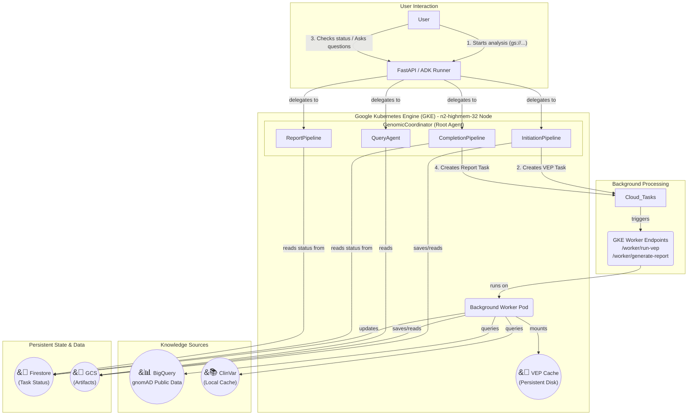

# Variant Analysis Multi-Agent System Documentation

This document provides a comprehensive overview of the Variant Analysis Multi-Agent System, including its architecture, functional mechanisms, and agent prompts.

## 1. Project Goal

This project transforms a static, sequential variant analysis pipeline into a flexible, production-grade, multi-agent system. This system can perform a comprehensive, multi-hour analysis on large VCF files as a background task and then allow users to return later to conduct fast, interactive, conversational queries on the results, enriched with population frequency data from gnomAD.

## 2. Architecture

The system is architected as a set of coordinated microservices and agents, leveraging the strengths of both GKE for high-performance computing and Google Cloud's managed services for reliability and scalability.

-   **GKE Service:** A FastAPI server running on a powerful GKE node serves as the main entry point. It hosts the ADK `Runner` and the root `GenomicCoordinator` agent.
-   **`GenomicCoordinator` Agent:** A top-level `LlmAgent` that acts as an intelligent router. It understands user intent and delegates tasks to one of four specialized sub-pipelines.
-   **`InitiationPipeline`:** A `SequentialAgent` that handles the quick, initial submission. It parses the VCF file and creates a background task in Cloud Tasks for VEP annotation.
-   **Cloud Tasks & Background Workers:** Google Cloud Tasks manages long-running jobs.
-   **`CompletionPipeline`:** Checks VEP status and automatically triggers report generation when complete.
-   **`ReportPipeline`:** Retrieves and presents the final clinical report with population frequencies.
-   **`QueryAgent`:** A specialized `LlmAgent` that handles fast, conversational follow-up questions about the final results.
-   **Knowledge Integration:** BigQuery gnomAD and a local ClinVar cache.
-   **Persistent Storage:** Firestore, Google Cloud Storage (GCS), and a GCE Persistent Disk for the VEP cache.
-   **VEP Cache Version:** The system utilizes VEP version 113 (GRCh38) for variant annotation.

## 3. Features

-   **Multi-Agent Architecture:** Uses robust `SequentialAgent` workflows controlled by a top-level coordinator.
-   **Population Frequency Integration:** Queries gnomAD BigQuery for allele frequencies.
-   **Dual Reference Support:** Automatically queries both gnomAD v2 (GRCh37) and v3 (GRCh38).
-   **Long-Running Task Offloading:** Offloads VEP annotation and report generation to background workers via Google Cloud Tasks.
-   **Intelligent Clinical Assessment:** A "map-reduce" pattern analyzes pathogenic variants to generate a high-quality summary.
-   **Conversational Querying:** A dedicated `QueryAgent` allows for fast, interactive follow-up questions.

## 4. Analysis Modes

The system supports two analysis modes that fundamentally change what variants are analyzed. The mode is determined by the `IntakeAgent` at the beginning of the analysis based on the user's intent.

### Clinical Mode (Default)
- **Scope**: ACMG SF v3.3 secondary findings only (84 medically actionable genes).
- **Purpose**: Clinical reporting of incidental findings that require medical follow-up.
- **When to use**: This is the default mode for all clinical scenarios. It is the safer option for medical use.

### Research Mode
- **Scope**: Comprehensive genome-wide analysis (all genes).
- **Purpose**: Research and discovery.
- **When to use**: Only when explicitly requested for research. This mode is for comprehensive analysis and not for clinical decision-making.

## 5. Agent and Pipeline Details

The system is composed of a root coordinator agent that manages four distinct pipelines (sub-agents).

### Root Coordinator: `GenomicCoordinator`

This agent is the main entry point and router for the entire system.

**Description:** Coordinates genomic variant analysis workflows.

**Instructions:**
You are a genomic analysis coordinator that manages variant analysis and queries.

**OVERVIEW**
The analysis system has four main capabilities:
1.  **Initiation Phase**: Parse VCF file and start VEP annotation (quick, <1 minute)
2.  **VEP Completion Check**: Monitor VEP status (runs 30 min - 2 hours in background)
3.  **Report Generation**: Generate clinical report after VEP (3-10 minutes in background)
4.  **Query Phase**: Answer specific questions about variants and genes, generate visualizations (instant, after report is ready)

**USER GUIDANCE**
- For new analyses: Explain the multi-phase process and that everything runs in background.
- For status checks: Be clear about the current phase and estimated remaining time.
- For completed analyses: Present the clinical report clearly.
- For specific queries and visualizations: Use the `QueryAgent`.

### Phase 1: `InitiationPipeline`

This pipeline handles the initial parsing of the VCF file and submission of the VEP annotation job.

#### `IntakeAgent`

**Description:** Parses and validates VCF files from GCS paths and determines the analysis mode.

**Instructions:**
You are responsible for parsing and validating VCF files and intelligently determining the analysis mode.

1.  **Determine the analysis mode** based on the user's intent:
    -   Clinical findings → CLINICAL mode
    -   Research analysis → RESEARCH mode
    -   Default to CLINICAL mode if uncertain.
2.  **Set the analysis mode** using the `set_analysis_mode` tool. This must be done *before* parsing the VCF.
3.  **Inform the user** about the chosen mode and why.
4.  **Use the `vcf_intake_tool`** to parse the VCF file.
5.  **Report the results**, including the number of variants, analysis mode, and the artifact name.

#### `VepStartAgent`

**Description:** Initiates VEP (Variant Effect Predictor) annotation jobs.

**Instructions:**
You start VEP annotation for parsed variants.

-   Inform the user that VEP annotation is a long-running process (30 minutes to 2 hours).
-   Provide the `task ID` for status checking.
-   Explain that this is a background process.
-   Use the `start_vep_annotation` tool.

### Phase 2: `CompletionPipeline`

This pipeline checks the status of the VEP job and, upon completion, starts the report generation.

#### `VepCheckAgent`

**Description:** Checks the status of VEP annotation jobs.

**Instructions:**
Check the status of VEP annotation using the `check_vep_status` tool.

-   If **completed**: Announce completion and mention the output artifact name.
-   If **running/pending**: Inform the user of the status and suggest checking back later.
-   If **failed**: Report the error details.

#### `ReportStartAgent`

**Description:** Starts background report generation after VEP completes.

**Instructions:**
Start the report generation process when VEP is complete.

1.  **Check the analysis mode** from the system's state.
2.  **Start report generation** with the appropriate mode (`clinical` or `research`) using the `start_report_generation` tool.
3.  **Explain what's happening** based on the mode (e.g., focusing on ACMG secondary findings for clinical mode).
4.  **Provide the `task ID`** and explain that it's a background process.

### Phase 3: `ReportPipeline`

This pipeline retrieves and presents the final analysis report.

#### `ReportCheckAgent`

**Description:** Checks report generation status and retrieves completed reports.

**Instructions:**
Check the status of report generation and present completed reports using the `check_report_status` tool.

-   If **completed**: Present the clinical summary, key findings, and recommendations, noting the analysis mode used.
-   If **running/pending**: Inform the user it's still processing and provide a time estimate.
-   If **failed**: Report the error.

### Phase 4: `QueryAgent`

This agent handles specific, interactive queries about the analysis results after the report is complete.

**Description:** Handles specific queries about variants, genes, and generates visualizations.

**Instructions:**
You handle specific queries about variants and genes and can generate visualizations.

**Capabilities:**
1.  **Gene Queries**: Use `query_variant_by_gene` to find variants in a specific gene.
2.  **Visualizations**: Use visualization tools (`generate_chart_data_tool`, `compare_populations_tool_instance`, `filter_by_category_tool`) to create charts and graphs (bar, pie, histogram, heatmap, scatter).
3.  **Population Comparisons**: Compare variant frequencies across populations.
4.  **Category Filtering**: Filter variants by disease category (clinical mode only).

When responding, note the analysis mode (`clinical` or `research`) to provide context on the scope of the results.

## 6. User Journey

1.  **Start Analysis**: The user provides a GCS path to a VCF file. The system starts the `InitiationPipeline`.
2.  **Wait and Get Results**: The user waits for the long-running VEP and report generation processes to complete. They can check the status periodically.
3.  **Conversational Querying**: Once the report is ready, the user can ask specific follow-up questions about genes or request visualizations, which are handled by the `QueryAgent`.

For detailed setup, deployment, and usage instructions, please refer to the [README.md](README.md) file.
