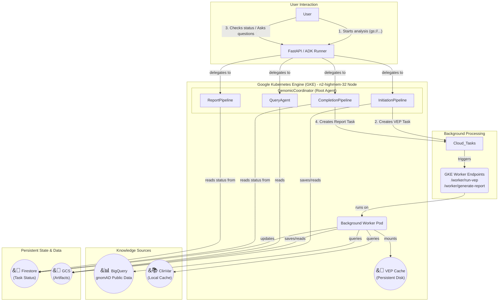

# Variant Analysis Multi-Agent System

This project implements a resilient and scalable multi-agent system using the Google Agent Development Kit (ADK) for dynamic and interactive genomic variant analysis. It is designed for production deployment on Google Kubernetes Engine (GKE) and is capable of processing large VCF files through a robust, multi-phase, conversational workflow with integrated population frequency analysis via gnomAD BigQuery.

## Project Goal

This project transforms a static, sequential variant analysis pipeline into a flexible, production-grade, multi-agent system. This system can perform a comprehensive, multi-hour analysis on large VCF files as a background task and then allow users to return later to conduct fast, interactive, conversational queries on the results, enriched with population frequency data from gnomAD.

## Architecture Overview

The system is architected as a set of coordinated microservices and agents, leveraging the strengths of both GKE for high-performance computing and Google Cloud's managed services for reliability and scalability.



1.  **GKE Service:** A FastAPI server running on a powerful GKE node serves as the main entry point. It hosts the ADK `Runner` and the root `GenomicCoordinator` agent.
2.  **`GenomicCoordinator` Agent:** A top-level `LlmAgent` that acts as an intelligent router. It understands user intent and delegates tasks to one of four specialized sub-pipelines.
3.  **`InitiationPipeline`:** A `SequentialAgent` that handles the quick, initial submission. It parses the VCF file and creates a background task in Cloud Tasks for VEP annotation.
4.  **Cloud Tasks & Background Workers:** Google Cloud Tasks manages long-running jobs:
    - VEP annotation (~1 hour)
    - Report generation with gnomAD/ClinVar queries (~3-5 minutes)
5.  **`CompletionPipeline`:** Checks VEP status and automatically triggers report generation when complete.
6.  **`ReportPipeline`:** Retrieves and presents the final clinical report with population frequencies.
7.  **`QueryAgent`:** A specialized `LlmAgent` that handles fast, conversational follow-up questions about the final results.
8.  **Knowledge Integration:**
    - **BigQuery gnomAD:** Queries population frequencies from public gnomAD datasets (v2 and v3)
    - **ClinVar:** Local cache for clinical significance annotations
9.  **Persistent Storage:**
    - **Firestore:** Reliably tracks the status of long-running jobs
    - **Google Cloud Storage (GCS):** Stores the large data artifacts (parsed variants, annotated variants, final findings) generated during the pipeline.
    - **GCE Persistent Disk:** Provides fast, read-only access to the pre-downloaded VEP cache for high-performance annotation.

## Features

- **Multi-Agent Architecture:** Uses robust `SequentialAgent` workflows controlled by a top-level coordinator for maximum reliability.
- **Population Frequency Integration:** Queries gnomAD BigQuery for allele frequencies across multiple populations.
- **Dual Reference Support:** Automatically queries both gnomAD v2 (GRCh37) and v3 (GRCh38) to handle reference mismatches.
- **Long-Running Task Offloading:** Intelligently offloads the multi-hour VEP annotation process to a background worker managed by Google Cloud Tasks.
- **Two-Phase Background Processing:**
  - Phase 1: VEP annotation (~1 hour)
  - Phase 2: Knowledge retrieval + clinical assessment (~3-5 minutes)
- **Non-Blocking Architecture:** All heavy operations run asynchronously or in background workers.
- **Optimized Performance:** Leverages a high-performance GKE node (32 vCPU / 256 GB RAM) and a pre-populated Persistent Disk for the VEP cache, reducing VEP processing time from 6+ hours to ~1 hour.
- **Intelligent Clinical Assessment:** Employs a sophisticated "map-reduce" pattern to analyze thousands of pathogenic variants, identify clinically significant patterns (like compound heterozygosity), and generate a high-quality summary.
- **Population-Aware Risk Assessment:** Incorporates ancestry-specific frequencies for precision medicine.
- **Conversational Querying:** After the analysis is complete, a dedicated `QueryAgent` allows for fast, interactive follow-up questions about specific genes.
- **HTTPS Support:** Production-ready HTTPS endpoint with SSL/TLS termination for secure API access from web frontends.

## Analysis Capabilities

This system performs comprehensive whole-genome analysis with population context, not targeted gene panels:

- Analyzes ALL 7.8M+ variants in the VCF
- Identifies ~1,000-2,000 pathogenic variants across all genes
- Queries population frequencies for up to 10,000 variants from gnomAD
- Provides ancestry-specific allele frequencies (African, European, East Asian, Latino, etc.)
- Calculates carrier frequencies and homozygote counts
- Uses pattern detection to highlight clinically significant findings
- Allows targeted queries for specific genes of interest

## Performance Characteristics

- VCF Parsing: ~30 seconds for 7.8M variants
- VEP Annotation: ~60-70 minutes for 7.8M variants (background)
- Report Generation (background, non-blocking):
  - ClinVar annotations: ~2 minutes
  - gnomAD frequencies: ~30 seconds for 10K variants
  - Clinical assessment: ~2 minutes
  - Total: ~3-5 minutes
- Gene Query: <5 seconds per query
- BigQuery costs: ~$0.50 per full analysis (well within free tier)

## Prerequisites

- Google Cloud SDK (`gcloud`)
- `kubectl` command-line tool
- Docker
- `envsubst` (from gettext-base package on Linux, or Homebrew on macOS)
- Python 3.10+
- A Google Cloud Project with the following APIs enabled:
  - Kubernetes Engine API
  - Artifact Registry API
  - Cloud Build API
  - Cloud Tasks API
  - Firestore API
  - BigQuery API (for gnomAD)
  - IAM API
- (Optional) Google Cloud DNS or another DNS provider
- The following environment variables should be set in your `.env` file or environment:
  - `CORS_PRODUCTION_ORIGINS`: Comma-separated list of allowed origins for production CORS.
  - `ALLOWED_AUTH_DOMAINS`: Comma-separated list of allowed email domains for authentication.
  - `PUBLIC_API_PREFIX`: (Optional) A prefix for all API routes, e.g., `/api`.

## Setup and Deployment

### 1. Google Cloud Services Setup (One-Time)

a. **Create Firestore Database:**

```bash
# Ensure GOOGLE_CLOUD_PROJECT and GOOGLE_CLOUD_LOCATION are set in your environment or .env file
# e.g., export GOOGLE_CLOUD_PROJECT="your-project-id"
# e.g., export GOOGLE_CLOUD_LOCATION="us-central1"
just setup-firestore
```

b. **Create Cloud Tasks Queue:**

```bash
just setup-cloud-tasks
```

c. **Create Artifact Registry Repository:**

```bash
just setup-artifact-registry
```

d. **Enable BigQuery API (for gnomAD):**

```bash
just enable-bigquery-api
```

### 2. GKE Infrastructure Setup

a. **Create GKE Cluster:**

```bash
just create-gke-cluster
```

b. **Get Cluster Credentials:**

```bash
just get-cluster-credentials
```

c. **Create Kubernetes Service Account:**

```bash
just create-k8s-service-account
```

d. **Set Up Workload Identity Binding:**

```bash
just setup-workload-identity
```

e. **Grant Required IAM Permissions:**

e. **Grant Required IAM Permissions:**
```bash
just grant-iam-permissions
```

````

### 3. VEP Cache Setup (one-time)

a. **Download VEP Cache and Upload to GCS (Run on a local machine or a temporary VM)**

This step downloads approximately 100GB of data and should only be performed once. The VEP cache data will be stored in your own GCS bucket.

```bash
# Create a GCS bucket to store the VEP cache permanently
just create-vep-bucket
just download-vep-cache
```

b. **Create and Populate Persistent Disk for VEP Cache:**

This step copies the data from your GCS bucket onto a GCE Persistent Disk, which provides much faster I/O for the VEP tool running in your GKE cluster.

```bash
# Create the disk
just create-vep-disk

# Create a temporary VM to load the cache data
just create-cache-loader-vm

# SSH into the VM and run the following commands inside it
just ssh-cache-loader-vm

# Delete the temporary VM (the disk and its data will remain)
just delete-cache-loader-vm
````

### 4. Application Setup

a. **Clone Repository & Install Dependencies:**

```bash
git clone <your-repo-url>
cd backend
python3 -m venv .venv
source .venv/bin/activate
pip install -r requirements.txt
```

b. **Update Dependencies (`requirements.txt`):**
Ensure these are included:

```
google-cloud-bigquery==3.11.4
google-cloud-firestore==2.11.1
google-cloud-tasks==2.13.1
```

c. **Configure Environment (`.env` file):**
Create a `.env` file in the root of the project and add:

```
GEMINI_API_KEY="AIzaSy..."
GOOGLE_CLOUD_PROJECT="<YOUR_PROJECT_ID>"
```

d. **Authenticate `gcloud`:**

```bash
gcloud auth application-default login
```

### 5. Build and Deploy

a. **Build and Push the Docker Image:**

```bash
# Ensure GOOGLE_CLOUD_PROJECT and GOOGLE_CLOUD_LOCATION are set in your environment or .env file
just build
```

b. **Create Kubernetes Secret:**

```bash
# Ensure GEMINI_API_KEY is set in your environment or .env file
just create-gemini-secret
```

c. **Deploy to GKE:**

- The deployment uses environment variables for configuration. Ensure that `GOOGLE_CLOUD_PROJECT`, `TASKS_QUEUE_NAME`, and `WORKER_URL` are correctly set in your environment or `.env` file before running.
- The `gke/genomics-deployment.yaml` file is templated using `envsubst`.

```bash
just deploy
```

d. **Deploy to GKE with IAP:**

- The deployment uses environment variables for configuration. Ensure that `GOOGLE_CLOUD_PROJECT`, `TASKS_QUEUE_NAME`, and `WORKER_URL` are correctly set in your environment or `.env` file before running.
- The `gke/genomics-deployment-iap.yaml` file is templated using `envsubst`.

```bash
just deployi-iap
```


### 6. Set up Identity-Aware Proxy (IAP) Credentials

To secure your application behind Google Cloud Identity-Aware Proxy (IAP), you must create an OAuth Client ID and Secret specifically configured for IAP. Since the gcloud CLI tools for OAuth are deprecated, this must be done via the Google Cloud Console.

**Option 1: Create a Brand New OAuth Client ID and Secret (Recommended)**

1. Go to **APIs & Services > Credentials** in the [Google Cloud Console](https://console.cloud.google.com/).
2. Make sure you are in the correct project (`<YOUR_PROJECT_ID>`).
3. Click **+ CREATE CREDENTIALS** at the top of the page and select **OAuth client ID**.
4. Set **Application type** to **Web application**.
5. Give it a descriptive **Name** (e.g., "Genomics IAP Client").
6. Click **Create**. A modal will pop up displaying your brand new **Client ID** and **Client secret**. Copy both of these.
7. **Important Next Step (Redirect URI):** Because this is for IAP, you must tell Google to allow IAP to handle the login redirects.
   - Click on the name of the new client you just created to edit it.
   - Under **Authorized redirect URIs**, click **+ ADD URI**.
   - Enter the following exact URL, replacing `<YOUR_NEW_CLIENT_ID>` with the Client ID you just generated:
     `https://iap.googleapis.com/v1/oauth/clientIds/<YOUR_NEW_CLIENT_ID>:handleRedirect`
   - Click **Save**.

**Option 2: Reset the Secret for an Existing Client ID**

If you already have a "Web client (auto created by Google Service)" and just need to rotate its secret:

1. Go to **APIs & Services > Credentials** in the Cloud Console.
2. Under the **OAuth 2.0 Client IDs** section, click on the name of your existing client.
3. On the right-hand side, click the **RESET SECRET** button.
4. Confirm the prompt to generate a new secret. Note that the old secret will stop working immediately.

Once you have your Client ID and Client secret:

1.  Set `IAP_CLIENT_ID` and `IAP_CLIENT_SECRET` in your environment or `.env` file.
2.  Run the `just` command to create the Kubernetes secret:
    ```bash
    just setup-iap-secret
    ```

## 7. Vertex AI Reasoning Engine Setup

This project leverages Google Cloud's Vertex AI for conversational session persistence, allowing for more robust and stateful interactions with the agents.

### Prerequisites
- Ensure `aiplatform.googleapis.com` is enabled in your Google Cloud Project.
- The following environment variables set in your shell or `.env` file:
  - `AGENT_ENGINE_ID`: The ID of your Vertex AI Agent Engine.
  - `USE_VERTEX_AI_SESSIONS`: Set to `true` to enable Vertex AI for session persistence.
  - `VERTEX_AI_LOCATION`: The Google Cloud region where your Vertex AI resources are located (e.g., `us-central1`).
  - `REASONING_ENGINE_SA`: The service account for the Reasoning Engine.

### Setup Steps

a. **Enable Vertex AI and Set Up IAM Roles:**
```bash
just setup-vertex-ai
```

b. **Create the Agent Engine:**
```bash
just create_agent_engine
```

## 8. HTTPS Load Balancer Setup (Production)

This section describes how to set up a production-ready Google Cloud HTTPS Load Balancer with your own domain. The `justfile` provides recipes to automate most of this process.

### Prerequisites

- A domain name (e.g., `api.yourdomain.com`)
- Access to your domain's DNS settings
- The following environment variables set in your shell or `.env` file:
  - `GOOGLE_CLOUD_PROJECT`
  - `GOOGLE_CLOUD_ZONE` (e.g., `us-central1-a`)
  - `PUBLIC_API_DOMAIN` (e.g., `api.yourdomain.com`)

### Step 1: Reserve a Static IP and Configure DNS

a. **Reserve the IP address:**

```bash
just reserve-global-ip
```

b. **Get the IP address:**

```bash
# The default IP name is 'my-global-ip', check the justfile if you changed it.
gcloud compute addresses describe my-global-ip --global --format="value(address)"
```

c. **Configure DNS:**
Add an **A record** in your domain's DNS settings:

- **Name**: `api` (or your preferred subdomain)
- **Type**: `A`
- **Value**: The static IP address from the previous step.
- **TTL**: 300 (or your preference)

Wait for DNS propagation (this can take 5-30 minutes).

### Step 2: Create SSL Certificate

Google will provision and manage a free SSL certificate for your domain.

```bash
just create-ssl-cert
```

_Note: SSL certificate provisioning can take up to 60 minutes. You can check the status with `gcloud compute ssl-certificates describe genomics-managed-cert --global`._

### Step 3: Set up Firewall and Load Balancer Components

This single command will:

1.  Create the necessary firewall rules for health checks.
2.  Create a health check.
3.  Create a backend service.
4.  Add your GKE instance group to the backend service.
5.  Create a URL map.
6.  Create an HTTPS proxy.
7.  Create a forwarding rule to route traffic to your service.

```bash
just setup-load-balancer
```

### Step 4: Verify Setup

It may take a few minutes for the backend service to report as healthy.

a. **Check backend health:**

```bash
just check-backend-health
```

Wait until the `healthState` is `HEALTHY`.

b. **Test the HTTPS endpoint:**

```bash
curl https://{{PUBLIC_API_DOMAIN}}/health
```

### Tearing Down the Load Balancer

To avoid ongoing costs, you can delete all the load balancer components with a single command.

```bash
just destroy-load-balancer
```

### Option 2: Ngrok (Quick Development/Testing)

For rapid development and testing without setting up a full load balancer, ngrok provides a quick HTTPS tunnel to your service.

#### Setup Ngrok

1. **Install ngrok:**

```bash
# macOS
brew install ngrok

# Linux
snap install ngrok

# Or download from https://ngrok.com/download
```

2. **Create free ngrok account** at https://ngrok.com and get your auth token

3. **Authenticate ngrok:**

```bash
ngrok config add-authtoken YOUR_AUTH_TOKEN
```

4. **Create tunnel to your Kubernetes LoadBalancer:**

```bash
# Get your LoadBalancer external IP
kubectl get service genomics-agent-service
# Note the EXTERNAL-IP

# Create HTTPS tunnel
ngrok http http://<YOUR_EXTERNAL_IP>
```

5. **Use the ngrok URL:**
   Ngrok will provide a URL like `https://abc123.ngrok.io` that you can use immediately for testing.

**Ngrok Advantages:**

- Instant HTTPS endpoint
- No DNS configuration needed
- Great for development and demos
- Includes request inspection

**Ngrok Limitations:**

- URL changes on each restart (unless using paid plan)
- Rate limits on free tier
- Not suitable for production
- Adds latency

### Troubleshooting HTTPS Setup

**Backend shows unhealthy:**

```bash
# Check if NodePort is accessible
curl http://<NODE_EXTERNAL_IP>:<NODEPORT>/health

# Check firewall rules
gcloud compute firewall-rules list | grep <NODEPORT>

# Check health check configuration
gcloud compute health-checks describe genomics-api-health-check
```

**SSL certificate not provisioning:**

- Ensure DNS is properly configured and propagated
- Certificate provisioning can take up to 60 minutes
- Check certificate status:

```bash
gcloud compute ssl-certificates describe genomics-api-cert --global
```

**Mixed content errors in browser:**

- Ensure all API calls use HTTPS
- Update frontend to use `https://api.yourdomain.com` instead of HTTP endpoints
- Check browser console for specific mixed content warnings

## Population Frequency Analysis (gnomAD Integration)

The system now includes comprehensive population frequency analysis via BigQuery:

### Features

- **Dual Database Support:** Queries both gnomAD v2 (GRCh37) and v3 (GRCh38) to handle reference genome differences
- **Population Stratification:** Returns frequencies for:
  - African (AFR)
  - Latino/Admixed American (AMR)
  - East Asian (EAS)
  - European Non-Finnish (NFE)
  - Finnish (FIN)
  - Ashkenazi Jewish (ASJ)
  - South Asian (SAS)
  - Other populations (OTH)
- **Clinical Metrics:** Provides allele counts, allele numbers, and homozygote counts
- **Cost-Optimized:** Limits queries to 10,000 variants per analysis (~$0.50 per run)

### Example gnomAD Output

For a pathogenic APOB variant:

```json
{
  "variant": "2:21006087:C>T",
  "source": "gnomAD_v2",
  "global_af": 0.000064,
  "carrier_frequency": "1 in 15,686",
  "population_frequencies": {
    "african": 0.0,
    "european_non_finnish": 0.000065,
    "east_asian": 0.0,
    "latino": 0.0
  },
  "homozygotes": 0,
  "clinical_interpretation": "European-specific, very rare, high penetrance suspected"
}
```

## How to Use (User Journey)

### Phase 1: Start Analysis

1.  **Get a unique session ID:**

    ```bash
    SESSION_ID="my-analysis-$(date +%s)"
    echo "Using Session ID: $SESSION_ID"
    ```

2.  **Get Firebase Auth Token:**

    ```bash
    # You'll need to obtain a Firebase ID token from your authenticated user
    # This typically comes from your frontend application
    FIREBASE_TOKEN="your-firebase-id-token"
    ```

3.  **Send the VCF path:**

    ```bash
        # For HTTPS (production)
        # Adjust the URL if you are using PUBLIC_API_PREFIX, e.g., PUBLIC_API_DOMAIN/api/run
        curl -X POST https://${PUBLIC_API_DOMAIN}/run \
          -H "Content-Type: application/json" \
          -H "Authorization: Bearer $FIREBASE_TOKEN" \
          -d '{
            "session_id": "'$SESSION_ID'",
            "input_text": "Please analyze gs://brain-genomics/awcarroll/vcf_agent/HG002.novaseq.pcr-free.30x.deepvariant-v1.0.grch38.pathogenic.sort.vcf.gz"
          }'
        
        # For HTTP (development only)
        # Adjust the URL if you are using PUBLIC_API_PREFIX, e.g., YOUR_GKE_IP/api/run
        curl -X POST http://<YOUR_GKE_IP>/run \
          -H "Content-Type: application/json" \
          -H "Authorization: Bearer $FIREBASE_TOKEN" \
          -d '{
            "session_id": "'$SESSION_ID'",
            "input_text": "Please analyze gs://brain-genomics/awcarroll/vcf_agent/HG002.novaseq.pcr-free.30x.deepvariant-v1.0.grch38.pathogenic.sort.vcf.gz"
          }'    ```

4.  **Receive the Task ID** from the immediate response.

### Phase 2: Wait and Get Results

1.  **Wait** for the VEP process to complete (~60-70 minutes). Monitor logs if desired.

2.  **Check status and trigger report generation:**

    ```bash
    # Adjust the URL if you are using PUBLIC_API_PREFIX, e.g., PUBLIC_API_DOMAIN/api/run
    curl -X POST https://${PUBLIC_API_DOMAIN}/run \
      -H "Content-Type: application/json" \
      -H "Authorization: Bearer $FIREBASE_TOKEN" \
      -d '{
        "session_id": "'$SESSION_ID'",
        "input_text": "Is my VEP analysis complete?"
      }'
    ```

    The system will automatically start report generation (3-5 minutes) if VEP is complete.

3.  **Get the final report:**
    ```bash
    # Adjust the URL if you are using PUBLIC_API_PREFIX, e.g., PUBLIC_API_DOMAIN/api/run
    curl -X POST https://${PUBLIC_API_DOMAIN}/run \
      -H "Content-Type: application/json" \
      -H "Authorization: Bearer $FIREBASE_TOKEN" \
      -d '{
        "session_id": "'$SESSION_ID'",
        "input_text": "Is my report ready? Please provide the clinical assessment."
      }'
    ```

### Phase 3: Conversational Querying

1.  After receiving the main report, ask specific follow-up questions:

    ```bash
    # Adjust the URL if you are using PUBLIC_API_PREFIX, e.g., PUBLIC_API_DOMAIN/api/run
    curl -X POST https://${PUBLIC_API_DOMAIN}/run \
      -H "Content-Type: application/json" \
      -H "Authorization: Bearer $FIREBASE_TOKEN" \
      -d '{
        "session_id": "'$SESSION_ID'",
        "input_text": "Were any pathogenic variants found in the APOB gene?"
      }'
    ```

2.  Receive a fast, detailed answer in seconds.

## Example Enhanced Output

The system now provides population-aware analysis:

```
Clinical Summary:
- Identified 1,166 pathogenic variants across 824 genes
- European-specific risk variants detected in APOB (1:15,686 carriers)
- Lynch syndrome variants (MSH2, EPCAM) require cascade screening
- Population screening recommended for common variants (AF > 1%)
- Family testing indicated for rare variants (AF < 0.01%)

Key Population Insights:
- 23 variants show population-specific patterns
- 5 variants absent in gnomAD suggest de novo mutations
- No homozygotes observed for 15 dominant variants (possible lethality)
```

## Common Issues

- **Pod stuck in Pending**: Check if previous pod still holds PersistentDisk lock
- **VEP fails**: Verify cache disk is properly mounted at `/mnt/cache`
- **Connection reset**: Assessment may timeout for very large datasets
- **Permission denied**: Ensure all IAM bindings are correctly configured
- **Cloud Tasks not triggering**: Verify queue name and location match your configuration
- **CORS errors**: Ensure your frontend domain is in the CORS allowed origins in `main.py`
- **Mixed content blocked**: Frontend must use HTTPS API endpoint, not HTTP
- **Health check failing**: Verify NodePort is correct and firewall rule exists
- **BigQuery permission denied**: Ensure BigQuery API is enabled and IAM roles are granted
- **gnomAD queries timeout**: Check if BigQuery client is initialized properly
- **Reference mismatch**: System automatically tries both v2 and v3 databases
- **Query costs excessive**: Limited to 10,000 variants per analysis by default

## Security Considerations

- **Authentication**: All API endpoints require Firebase authentication
- **HTTPS**: Production deployments should always use HTTPS to protect data in transit
- **CORS**: Configure allowed origins appropriately in `main.py`
- **Firewall Rules**: Only open necessary ports; health check rules should restrict source IPs
- **Secrets Management**: Use Kubernetes secrets for API keys, never commit them to repository

## Cost Management

**This deployment uses powerful and expensive compute resources.** To avoid unnecessary costs:

### Daily Cost Estimates (approximate):

- GKE n2-highmem-32 node: ~$20-30/day when running
- BigQuery (gnomAD queries): ~$0.50 per full analysis
- HTTPS Load Balancer: ~$0.50/day
- Persistent Disk (100GB): ~$0.17/day
- Firestore & Cloud Tasks: Usage-based, typically minimal
- **First 1TB of BigQuery queries per month are FREE**

### Cost Optimization:

```bash
# Scale down to 0 pods when not in use (stops billing for the GKE node)
kubectl scale deployment genomics-agent --replicas=0

# Scale back up to 1 pod when needed
kubectl scale deployment genomics-agent --replicas=1

# Delete the HTTPS load balancer if not needed long-term
# (Can be recreated following the setup steps)
gcloud compute forwarding-rules delete genomics-api-https-rule --global --quiet
gcloud compute target-https-proxies delete genomics-api-https-proxy --global --quiet
gcloud compute url-maps delete genomics-api-url-map --quiet
gcloud compute backend-services delete genomics-gke-backend-service --global --quiet
gcloud compute health-checks delete genomics-api-health-check --quiet

# Keep the static IP reserved (minimal cost) for easy recreation
# gcloud compute addresses delete genomics-api-ip --global --quiet  # Only if you don't need it
```

## Development vs Production

### Development Setup

- Use HTTP with Kubernetes LoadBalancer service
- Or use ngrok for quick HTTPS testing
- Single replica
- Permissive CORS settings

### Production Setup

- Use HTTPS Load Balancer with custom domain
- SSL certificate management
- Appropriate CORS restrictions
- Health checks and monitoring
- Consider adding Cloud Armor for DDoS protection
- Add Cloud CDN for static content caching

## Monitoring and Debugging

```bash
# View pod logs
just logs

# Check load balancer logs
gcloud logging read "resource.type=http_load_balancer" --limit=20 --format=json

# Monitor backend health
watch gcloud compute backend-services get-health genomics-gke-backend-service --global

# Check SSL certificate status
gcloud compute ssl-certificates describe genomics-api-cert --global

# Test health endpoint
curl -v https://api.yourdomain.com/health

# Monitor BigQuery usage
gcloud logging read "resource.type=bigquery_project" --limit=20 --format=json

# Check BigQuery job history
bq ls -j -a -n 20

# Test gnomAD integration
kubectl exec -it deployment/genomics-agent -- python -c "
from services.gnomad_client import GnomADClient
import asyncio
client = GnomADClient()
# Test query would go here
"
```

## Architecture Benefits

The gnomAD BigQuery integration provides several advantages:

- **No local storage**: Eliminates 16GB local gnomAD database
- **Always current**: Uses latest gnomAD releases maintained by Broad Institute
- **Scalable**: Can query millions of variants efficiently
- **Cost-effective**: Leverages Google's free tier (1TB/month)
- **Non-blocking**: Async queries prevent UI freezing
- **Comprehensive**: Access to all populations and subpopulations
-
